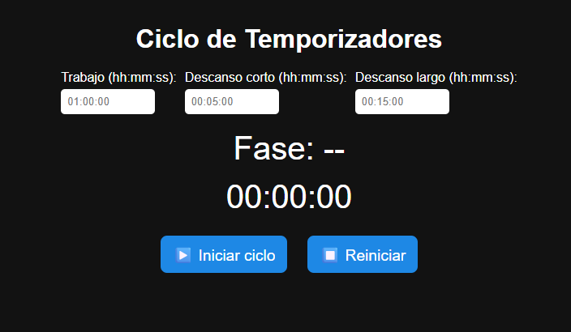

## Pomodoro Timer 🍅⏰

¡Bienvenido al **Pomodoro Timer**! Este proyecto es una aplicación sencilla pero poderosa basada en la técnica de productividad **Pomodoro**, que te ayuda a maximizar tu concentración y eficiencia durante tus sesiones de trabajo.

La aplicación divide tu tiempo en intervalos de trabajo de **25 minutos** seguidos por **descansos de 5 minutos**. Después de 4 sesiones de trabajo, tendrás un descanso largo de **15 minutos**. ¡Pon en práctica la técnica Pomodoro y alcanza tus objetivos con facilidad!

## 💻 Tecnologías utilizadas

- **HTML** - Estructura del proyecto
- **CSS** - Estilos y diseño atractivo
- **JavaScript** - Lógica del temporizador y funcionalidad

## 📸 Captura de pantalla

Aquí tienes una vista previa de la aplicación:
()

## 🚀 Instalación

1. Clona este repositorio en tu máquina local:
   
   git clone https://github.com/GutierrezCesar/Cronometro-pomodoro.git

🛠️ Funcionalidades
Temporizador de trabajo: 25 minutos de enfoque total.

Descanso corto: 5 minutos para descansar.

Descanso largo: 15 minutos después de completar 4 sesiones de trabajo.

Notificaciones sonoras: Al finalizar cada sesión, recibirás una notificación.

Pausar y reiniciar: Control total sobre el temporizador.

📦 ¿Cómo usarlo?
Haz clic en Iniciar para comenzar una sesión de trabajo de 25 minutos.

Al finalizar el tiempo de trabajo, automáticamente entrará el descanso corto de x minutos. De acuerdo al tiempo que crees que vas a descansar

Después de completar 4 ciclos de trabajo, disfrutarás de un descanso largo de x minutos. De acuerdo al tiempo que crees que vas a descansar

Puedes pausar o resetear el temporizador en cualquier momento.

🌐 URL del proyecto
Accede al proyecto en línea a través de esta URL para usarlo directamente desde tu navegador.
